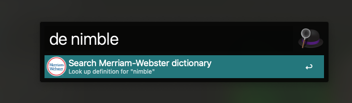
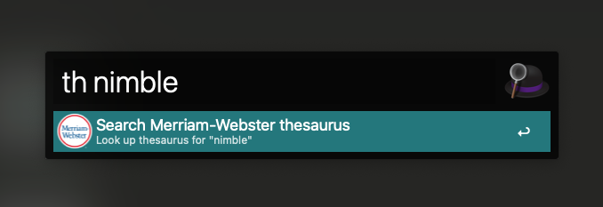

# Merria-Webster Alfred workflow

This is an [Alfred workflow](https://www.alfredapp.com/workflows/) that lets you quickly search the Merriam Webster dictionary and thesaurus.

## Installation
Download the `.alfredworkflow` file from the [latest release](https://github.com/sajadtorkamani/merriam-webster-alfred-workflow/releases).

## Usage

### Look up dictionary

Press your Alfred hotkey and type `de {query}`.

### Look up thesaurus

Press your Alfred hotkey and type `th {query}`.

